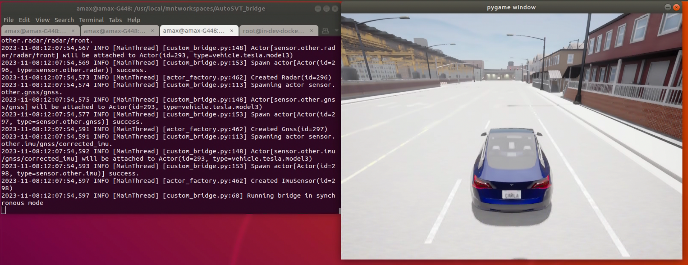
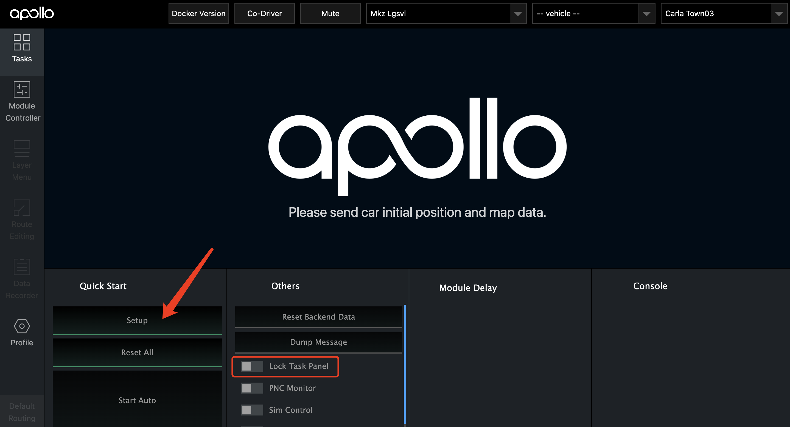
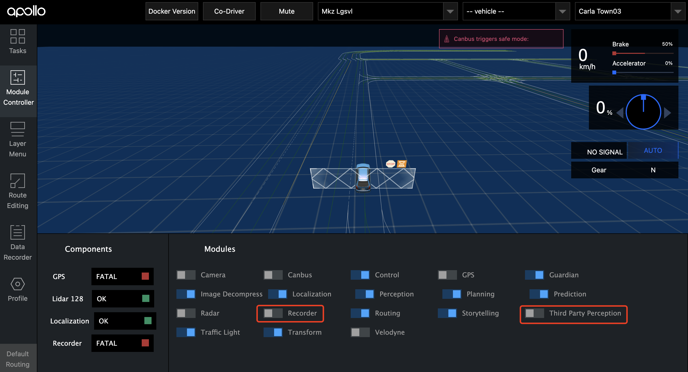
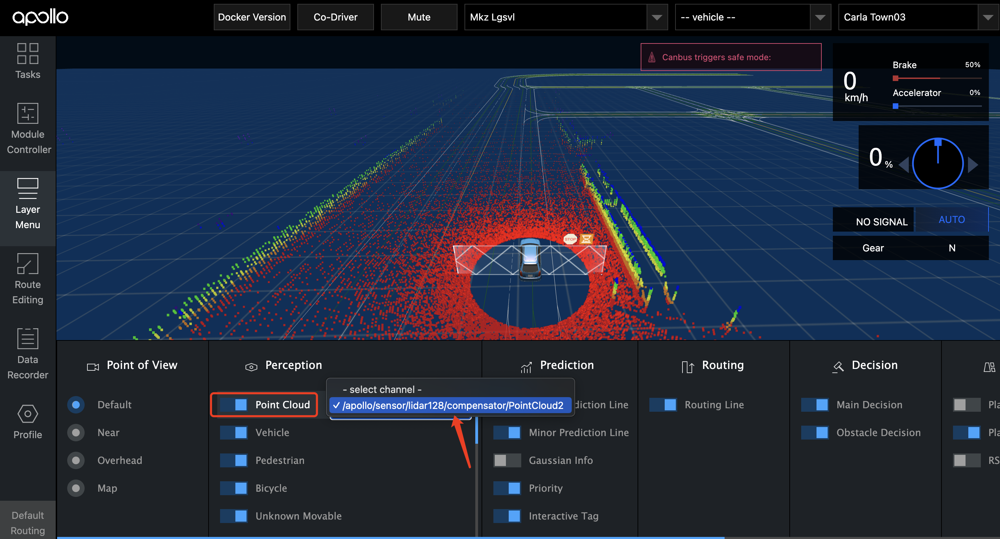
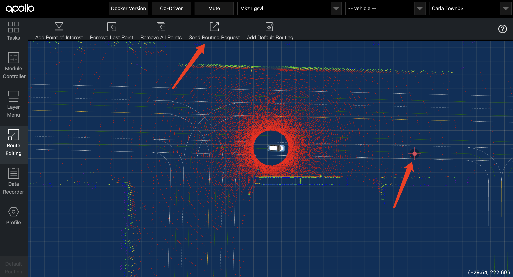

# [AutoSVT]Carla-Apollo-Bridge

This project is designed to connect [AutoSVT-Carla](https://github.com/idslab-autosec/AutoSVT-Carla) (v0.9.14) and [Apollo](https://github.com/ApolloAuto/apollo) (v8.0.0) for co-simulation. AutoSVT-Carla, based on the original Carla, incorporates a first-principles-based LiDAR simulation that can simulate the **impact of fog on LiDAR**, allowing for testing the performance of autonomous driving systems in adverse weather conditions. 

Our simulation encompasses all modules from perception to control. Carla sends sensor data such as images, point clouds, and vehicle chassis information to Apollo, while Apollo sends control commands to Carla.


## Installation
### 0. Prerequisite
- Ubuntu (>=18.04)
- Python (>=3.8)


### 1. Install AutoSVT-Carla
```bash
docker pull idslabautosec/carla-fog:v1
```

### 2. Install Apollo
Please follow the [official Apollo documentation](https://github.com/ApolloAuto/apollo) for installation.

### 3. Install Python Dependencies
Install the AutoSVT-Carla Python package. 
**Note**: 
1. Unlike the original Carla Python package, do not install it using `pip install carla`. 
2. It's recommended to use a conda environment.

```bash
cd AutoSVT-Carla/PythonAPI/carla/dist/
# Please install the .whl file corresponding to your python version.
pip install carla-0.9.14-cp38-cp38-linux_x86_64.whl
```

Install other Python packages.

```bash
cd AutoSVT-Carla-Apollo-Bridge
pip install -r requirements.txt
```

### 4. Configure CYBER_IP
TODO

### 5. Configure Apollo
TODO


## Quick Start
### 1. Run AutoSVT-Carla
If you would like to run Carla with docker,
```bash
docker-compose up
```

```bash
cd AutoSVT-Carla
./CarlaUE4.sh

# If you don't need the Carla graphics, 
# you can use `-RenderOffScreen`.
# You can specify the GPU using 
# `-ini:[/Script/Engine.RendererSettings]:r.GraphicsAdapter=1`
./CarlaUE4.sh -RenderOffScreen -ini:[/Script/Engine.RendererSettings]:r.GraphicsAdapter=1
```

### 2. Run Apollo
```bash
cd apollo/docker/scripts
sudo bash dev_start.sh -l
sudo bash dev_into.sh

# Inside the Apollo Docker container
./scripts/bootstrap.sh # Run Dreamview
```

### 3. Run Bridge
```bash
cd AutoSVT-Carla-Apollo-Bridge
python src/bridge_with_ego.py
```
After successfully running the bridge, you will see a pygame graphical interface.


### 4. Start Co-simulation
Access `localhost:8888` in a web browser. Disable "Lock Task Panel", and click "Setup" to enable all modules. 


Once the Modules are enabled, in the Module Controller, disable "Recorder" (if data recording is not needed) and "Third Party Perception".


[Optional] If you want to view LiDAR point cloud data, open "Point Cloud" in the "Layer Menu" and select the channel.


Click on the destination in the "Route Editing" map, and then click "Send Routing Request". The ego vehicle controlled by Apollo will start autonomous driving in Carla!


### 4. Scripts
This project provides some Python scripts for Carla, making testing more convenient. For detailed information, please visit [scripts.md](docs/scripts.md).

## Configuration

The configuration files for sensors and simulation can be found in the `src/config/` directory. Use `objects.json` to configure the sensors for the ego vehicle, and `settings.yaml` to configure Carla parameters.

When using LiDAR, please set the type to `"type": "sensor.lidar.ray_cast_with_fog"` instead of `"type": "sensor.lidar.ray_cast"`.

## Acknowledgments
This project is built upon the following open-source projects:
- [AuroAi/carla_apollo_bridge](https://github.com/AuroAi/carla_apollo_bridge)
- [casper-auto/carla-apollo](https://github.com/casper-auto/carla-apollo)
- [guardstrikelab/carla_apollo_bridge](https://github.com/guardstrikelab/carla_apollo_bridge)
- [MaisJamal/carla_apollo_bridge](https://github.com/MaisJamal/carla_apollo_bridge)


AutoSVT-Carla is based on the following open-source projects:
- [Carla](https://github.com/carla-simulator/carla)
- [MartinHahner/LiDAR_fog_sim](https://github.com/MartinHahner/LiDAR_fog_sim)
